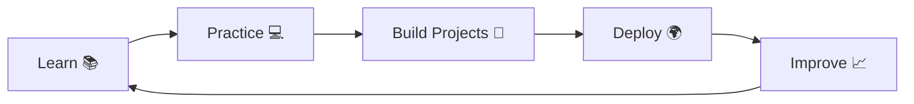

<div align="center">

#  Hi, I'm Umesh Yadav


</div>

---

<div align="center">


</div>

---

# 🚀 About Me


### 👨‍💻 Software Engineer

- 🇮🇳 From India
- 🎓 B.Tech Computer Science Engineer
- 💻 Java Full Stack Developer
- 🌐 MERN Stack Developer
- 🚀 Spring Boot Enthusiast
- ❤️ Love Building Real World Applications
- 📚 Learning System Design
- ☁️ Learning AWS
- 🐳 Docker Beginner
- 🧠 DSA Enthusiast

### 🎯 Current Goal

> Build scalable software and become a Software Engineer in a Product-Based Company.

---

# ⚡ Fun Fact

```cpp
while(alive)
{
    Learn();
    Code();
    Sleep();
    Repeat();
}
```

---

# 🛠 Tech Stack

<div align="center">

### Programming Languages


### Frontend


### Backend


### Database


### Tools


### Cloud & DevOps


</div>

---

# 💻 Core Computer Science

| Subject | Status |
|----------|--------|
| Data Structures | ✅ |
| Algorithms | ✅ |
| OOP | ✅ |
| DBMS | ✅ |
| Operating System | ✅ |
| Computer Networks | ✅ |
| SDLC | ✅ |
| REST API | ✅ |

---
# 🚀 Featured Projects

<div align="center">

| 🚀 Project | 💻 Tech Stack | ⭐ Highlights |
|------------|--------------|---------------|
| 🤖 **AI Auto Reply Platform** | Spring Boot • React • MySQL | AI Email Reply, Authentication, REST APIs |
| 🏦 **Enterprise Digital Banking System** | Spring Boot • React • MySQL | Secure Banking, Transactions, Dashboard |
| 🛋️ **Furniture E-Commerce Website** | React • Node.js • MySQL | Shopping Cart, Checkout, Admin Panel |
| 🎓 **Tech Grade Portal** | React • Express • MongoDB | Student Dashboard, Grades, Feedback |
| 🩺 **Doctor Appointment System** | MERN Stack | Online Booking, Admin Panel |
| 🎥 **Facial Recognition Attendance System** | Python • Django • MySQL | Face Detection, Automated Attendance |

</div>

---

# 🏆 Certifications

<div align="center">

| 📜 Certification | Status |
|------------------|--------|
| ☕ Java Programming | ✅ |
| 🗄 SQL | ✅ |
| 💻 Full Stack Development | ✅ |
| 🧠 Data Structures & Algorithms | ✅ |
| ☁ AWS Learning | 🚀 In Progress |

</div>

---

# 💼 Experience

```text
2024
│
├── Started Java Development
├── Built Multiple Academic Projects
│
2025
│
├── Full Stack Development
├── Spring Boot Projects
├── AI Auto Reply Platform
│
2026
│
├── Enterprise Banking System
├── Placement Preparation
└── Software Engineer 🚀
```

---

# 📚 Currently Learning

<div align="center">

| Technology | Progress |
|------------|----------|
| ☕ Spring Boot | █████████░ 90% |
| ⚛ React.js | ████████░░ 80% |
| 🍃 MERN Stack | ███████░░░ 75% |
| ☁ AWS | █████░░░░░ 50% |
| 🐳 Docker | █████░░░░░ 50% |
| 🧠 System Design | ████░░░░░░ 40% |

</div>

---

# 🎯 2026 Goals

- ✅ Crack Product-Based Company
- ✅ Master Spring Boot
- ✅ Learn Microservices
- ✅ Learn AWS & Docker
- ✅ 500+ LeetCode Problems
- ✅ Open Source Contributions
- ✅ Build Scalable Applications

---

# 📂 Learning Repositories

```text
📦 Java DSA
📦 SQL Practice
📦 Spring Boot Practice
📦 MERN Stack Projects
📦 Java Collections
📦 Design Patterns
📦 System Design Notes
📦 LeetCode Solutions
```

---

# 💡 Developer Philosophy

> **"Every expert was once a beginner. Every line of code makes me a better developer."**

---

# ⚡ Daily Routine

```java
public class Developer {

    public static void main(String[] args) {

        while(true){

            Learn();

            Code();

            BuildProjects();

            SolveDSA();

            Repeat();

        }

    }

}
```

---

# 🌟 Interests

- 💻 Software Development
- 🤖 Artificial Intelligence
- ☁ Cloud Computing
- 📱 Web Development
- 📚 Learning New Technologies
- 🚀 Open Source
  
---

# 📊 GitHub Analytics

<div align="center">


</div>

<br>

<div align="center">


</div>

---

# 📈 GitHub Activity Graph

<p align="center">


</p>

---

# 🏆 GitHub Trophies

<p align="center">


</p>

---

# 📊 Profile Summary

<p align="center">


</p>

---

# 🐍 Contribution Snake

<p align="center">


</p>

---

# 🌍 Connect With Me

<p align="center">

<a href="https://github.com/Ume-6666">

</a>

<a href="https://linkedin.com/in/umesh-yadav-1b57b2290">

</a>

<a href="mailto:uu820209@gmail.com">

</a>

</p>

---

# 💬 Quote of the Day

<p align="center">


</p>

---

# 👀 Profile Visitors

<p align="center">


</p>

---

# ❤️ Support My Work

<p align="center">

⭐ If you like my work, consider giving a star to my repositories!

🚀 Always open to learning, collaboration, and exciting opportunities.

</p>

---

<div align="center">

## 🚀 Thanks for Visiting My Profile!


### ⭐ *"Code. Learn. Build. Repeat."*

</div>
---

# 🌍 Coding Profiles

<div align="center">

<a href="https://leetcode.com/">

</a>

<a href="https://www.hackerrank.com/">

</a>

<a href="https://www.geeksforgeeks.org/">

</a>

<a href="https://www.codechef.com/">

</a>

</div>

---

# ⚡ Competitive Programming

<p align="center">


</p>

---

# 🚀 Tech Journey

```text
2022 ───────── Started B.Tech CSE
      │
2023 ───────── Learned C, C++, Java
      │
2024 ───────── DSA • SQL • Web Development
      │
2025 ───────── Spring Boot • React • MERN
      │
2026 ───────── Building Enterprise Projects 🚀
```

---

# 💻 Development Workflow



---

# 📌 My Toolbox

<table align="center">
<tr>
<td align="center">☕ Java</td>
<td align="center">🍃 Spring Boot</td>
<td align="center">⚛ React</td>
</tr>

<tr>
<td align="center">🟢 Node.js</td>
<td align="center">🍃 MongoDB</td>
<td align="center">🐬 MySQL</td>
</tr>

<tr>
<td align="center">🐳 Docker</td>
<td align="center">☁ AWS</td>
<td align="center">🐙 Git</td>
</tr>

</table>

---

# 🎯 2026 Roadmap

✅ Crack Product Based Company

✅ Master Spring Boot

✅ Learn Microservices

✅ AWS Cloud

✅ Docker

✅ Kubernetes

✅ 500+ LeetCode Problems

✅ Open Source Contributions

---

# 📈 Contribution Calendar

<p align="center">


</p>

---

# 🌟 Random Dev Joke

<p align="center">


</p>

---

# 🧠 Quote

> "Success isn't about writing thousands of lines of code.
>
> It's about solving real-world problems with clean, scalable solutions."

---

<div align="center">

## 🚀 Let's Build Something Amazing Together!


</div>
